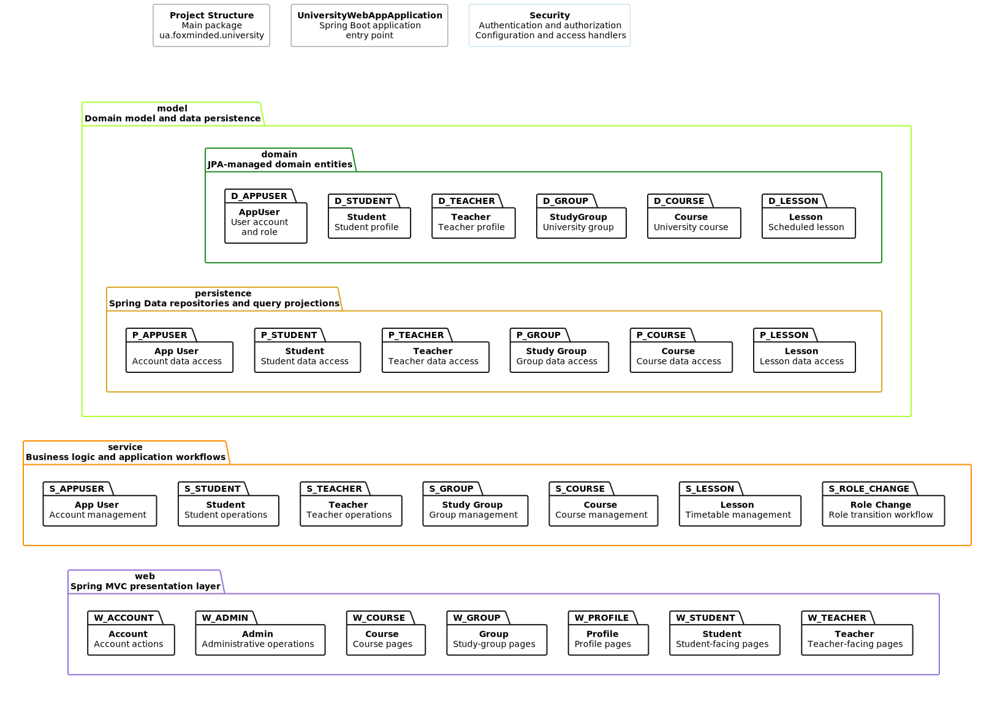
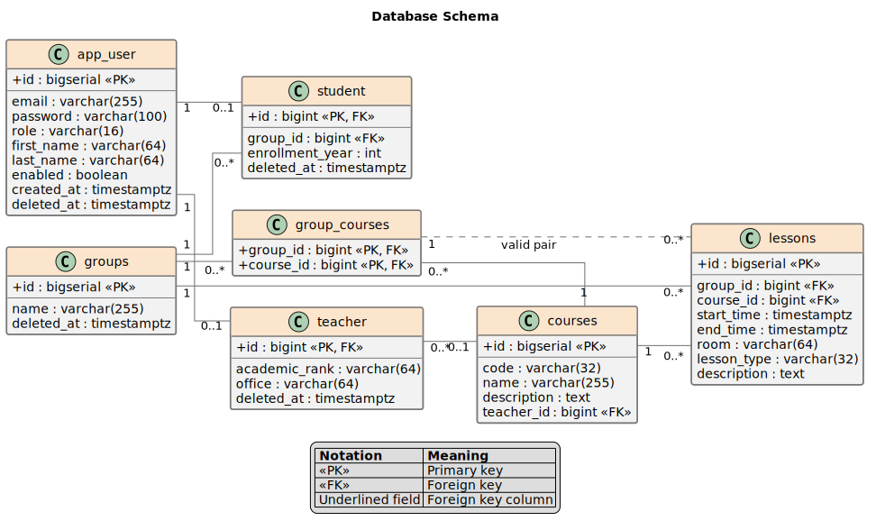

# University Timetable Management System

### GitHub Actions · Continuous Integration · Docker Publishing · Project Versioning · Python Scripts

[](https://github.com/Yurii-Kor/university-web-app/actions/workflows/university-web-app-ci.yml)
[](https://github.com/Yurii-Kor/university-web-app/actions/workflows/publish-docker.yml)
[](https://github.com/Yurii-Kor/university-web-app/actions/workflows/update-project-version.yml)


### Java 21 · Spring Boot 3.5.5 · Spring MVC · Spring Security · Thymeleaf · Spring Data JPA · PostgreSQL · HTML5 · CSS3


A role-based university timetable and academic management web application built with [Spring Boot](https://www.baeldung.com/spring-boot-start), Spring MVC, Thymeleaf, Spring Data JPA, and PostgreSQL.

The application provides role-specific workflows for students, teachers, and administrators. It supports account and profile management, study groups, courses, scheduled lessons, timetable views, user role transitions, and soft deletion with restoration of supported records.

Authentication is implemented through Spring Security [form login](https://www.baeldung.com/spring-security-login). Authorization is enforced through both HTTP security configuration and [method-level security](https://www.baeldung.com/spring-security-method-security), while [Spring Security integration with Thymeleaf](https://www.baeldung.com/spring-security-thymeleaf) controls role-dependent navigation, available actions, and page content.

The project follows a layered package structure that separates the domain model, Spring Data JPA persistence, application services, web presentation, and security concerns. Its test suite combines unit and integration testing with focused Spring MVC tests using [`@WebMvcTest`](https://www.baeldung.com/spring-boot-testing#unit-testing-with-webmvctest).


---


<details open>
<summary><h2>Project Structure</h2></summary>

The application source code is organized under the main package
[`src/main/java/ua/foxminded/university`](src/main/java/ua/foxminded/university).

`UniversityWebAppApplication` is the Spring Boot entry point. Security-related configuration, authentication services, password policies, and access handlers are grouped separately in the `security` package as a cross-cutting application concern.

The project follows a layered structure:

1. **Model layer**
   - **`domain`** — contains the JPA-managed entities and enums that represent the university domain: users, students, teachers, study groups, courses, and lessons.
   - **`persistence`** — contains Spring Data JPA repositories and their query projections, grouped by the corresponding domain entity.

2. **Service layer**
   - Contains the application business logic and use-case orchestration.
   - Services are grouped by functional area, together with their related DTOs and exceptions.
   - The separate `rolechange` package implements the workflow for transitioning users between student and teacher roles.

3. **Web layer**
   - Contains Spring MVC controllers, request binding, exception handling, and web configuration.
   - Web components are grouped by user-facing areas such as accounts, administration, courses, groups, profiles, students, and teachers.



Supporting DTOs, projections, validators, mappers, configuration classes, and exceptions are omitted from the diagram where necessary to keep the overall structure readable.

[View the PlantUML source](docs/architecture/application-structure.puml)

</details>


---


<details open>
<summary><h2>Database</h2></summary>

The application uses PostgreSQL as its relational database. Database connectivity, JPA integration, and transaction infrastructure are configured through Spring Boot.

The database layer is built around the following tools and responsibilities:

- **[Flyway migrations](src/main/resources/db/migration)** — create the database schema, define constraints and indexes, and populate the development environment with reproducible sample data.
- **[Hibernate-managed entities](src/main/java/ua/foxminded/university/model/domain)** — map the application domain model to relational tables through Jakarta Persistence annotations.
- **[Spring Data JPA repositories](src/main/java/ua/foxminded/university/model/persistence)** — provide repository interfaces, derived queries, JPQL queries, and query projections for database access.
- **[Service-layer transactions](src/main/java/ua/foxminded/university/service)** — combine repository operations into transactional business workflows.
- **PostgreSQL `pgcrypto`** — hashes generated development passwords with bcrypt-compatible `crypt()` and `gen_salt()` functions.

### Database Schema

The schema models application accounts, role-specific student and teacher profiles, study groups, courses, group-course assignments, and scheduled lessons.



[View the PlantUML source](docs/architecture/database-schema.puml)

### Generated Development Data

The seed migration creates a repeatable development dataset for running and demonstrating the application locally. Insert operations use conflict handling where appropriate, allowing the migration logic to avoid duplicating existing records.

| Entity / table | Generated records | Description |
|---|---:|---|
| `app_user` | 108 | Creates 100 student accounts, 6 teacher accounts, and 2 administrator accounts. One account of each role is disabled for authorization and account-state testing. |
| `student` | 100 | Creates one student profile for every student account and distributes the students across the five study groups. The enrollment year is set to the current year. |
| `teacher` | 6 | Creates one teacher profile for every teacher account, with a generated office and an academic rank selected from `LECTURER`, `SENIOR_LECTURER`, or `PROFESSOR`. |
| `groups` | 5 | Creates the study groups `CS-101`, `CS-102`, `CS-103`, `CS-104`, and `CS-105`. |
| `courses` | 10 | Creates courses covering Java, databases, networking, operating systems, Spring Boot, frontend development, machine learning, computer graphics, and application security. |
| `group_courses` | 15 | Assigns three courses to each study group and defines the valid group-course combinations used by the timetable. |
| `lessons` | 0 | The base seed migration does not create scheduled lessons; they can be added through the application workflows or dedicated test data. |

Generated accounts follow predictable development-only credential patterns:

| Role | Email pattern | Password pattern |
|---|---|---|
| Teacher | `teacherN@mail.com` | `Tch-N!dev` |
| Student | `studentN@mail.com` | `Std-N!dev` |
| Administrator | `adminN@mail.com` | `Adm-N!dev` |

> [!IMPORTANT]
> These credentials are intended only for local development, demonstrations, and automated tests. They must not be used in a production environment.

</details>


---


<details open>
<summary><h2>🐳 Dockerization</h2></summary>

The application is containerized with Docker and published as a versioned image to Docker Hub.

- **Project versioning** — the [`update-project-version.yml`](.github/workflows/update-project-version.yml) workflow updates the Maven project version in `pom.xml` on the `dev` branch.
- **Release publishing** — after the completed changes are merged into `main`, the [`publish-docker.yml`](.github/workflows/publish-docker.yml) workflow is started manually. It creates a Git tag from the current Maven version and publishes the Docker image with both the version-specific tag and `latest`.
- **Container image** — published in the [University Web App Docker Hub repository](https://hub.docker.com/repository/docker/yuriikorolkov/university-web-app/general).

[](https://hub.docker.com/repository/docker/yuriikorolkov/university-web-app/general)

Latest image:

```bash
docker pull yuriikorolkov/university-web-app:latest
```

</details>


---


## User Stories


### Auth

**Story:** As a User (Student/Teacher), I log in with email + password and land on my own data.  

**Acceptance**

- **Given** valid credentials  

- **When** I submit the login  

- **Then** I receive my profile `{id, role, firstName, lastName}` and the UI shows my role badge  

- **Else** invalid credentials → clear error without extra details


---


### Courses (tile view + course details)


#### Student

**Story:** See the courses I study and open a course.  

**Acceptance**

- **Given** I’m logged in as Student  

- **When** I open *Courses*  

- **Then** I see tiles `{id, code, name}` of **my** courses  

- **And** clicking a tile opens **Course details** `{name, description, my group}`


#### Teacher

**Story:** See the courses I teach and open a course.  

**Acceptance**

- **Given** I’m logged in as Teacher  

- **When** I open *Courses*  

- **Then** I see tiles of **my** courses  

- **And** clicking a tile opens **Course details** `{name, description, groups of the current course}`  

- *(Optional later: edit name/description)*


---


### Groups (read-only in MVP)

#### Teacher

**Story:** For a selected course, see all its groups and each group’s roster.  

**Acceptance**

- **Given** the course belongs to me  

- **When** I open *Course details*  

- **Then** I see the list of groups `{id, title}`  

- **And** opening a group shows its students `{id, fullName, email}`  

- **And** no add/remove of students in MVP (pre-seeded data)


#### Student

**Story:** In a selected course, see my group and its roster.  

**Acceptance**

- **Given** I open *Course details*  

- **Then** I see exactly one **my group** for that course (if any)  

- **And** opening it shows the roster (read-only)


---


### Schedule (Month / Day)

#### Student

**Story:** View my timetable for a month and drill down to a day.  

**Acceptance**

- **Given** I’m logged in as Student  

- **When** I open *Schedule* for `YYYY-MM`  

- **Then** I see Month view with indicators on days that have classes for my groups  

- **And** clicking a day shows a sorted list by `start` with `{time, courseName, groupTitle, room}`  

- **And** optional filters by `course`  

- **TZ:** results respect local timezone (e.g. Asia/Jerusalem); DB stores UTC


#### Teacher

**Story:** View my timetable and manage group slots.  

**Acceptance (view)**

- Month/Day like Student, but for my courses/groups; filters by `course/group`

**Acceptance (CRUD)**

- **Given** I’m logged in as Teacher - manager of the *Schedule* according to my   

- **When** I create/update/delete a slot `{start, end, room}`  

- **Then** students in that group see the changes  

- **And** validation: `end > start`, **no overlaps within the same group**  

- **Else** not owner → forbidden


---


## Non-functional (short)

- **Timezones:** store timestamps in UTC; return ISO-8601; render in **Asia/Jerusalem**.

- **Ranges:** Month = `\[firstDayT00:00, firstDayNextMonthT00:00)`, Day = `\[dateT00:00, nextDateT00:00)`, in local TZ.

- **Sorting:** by `start` (then `end`, then `courseName`).

- **Access:** Students see only their groups; Teachers only their own courses/groups.

